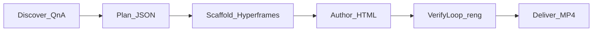

# Recursive Animation Engine (agent skill)

Deliver **high-quality video** from **HTML compositions** (Hyperframes) with **recursive vision checks** (`reng`). This file is the **canonical skill** for Claude Code, Cursor, OpenClaw, and similar agents.

**Long checklist:** [docs/AGENT_VIDEO_SKILL.md](docs/AGENT_VIDEO_SKILL.md)  
**Install, env vars, “How to use”:** [README.md](README.md)



---

## When to use

- Explainer / promo / tutorial / social **video** from HTML + motion
- **Multi-act** productions (plan → per-act build → combine)
- Anything where **visual correctness** must be checked (keyframes + vision)
- Agent should **own scaffolding** (dirs, `hyperframes init`, plan file) without the user memorizing CLIs

## When NOT to use

- **Still images only** → use `reng vision` alone if a single frame check is enough
- **Text-only** deliverables (no MP4 / no composition)
- **Generic web apps** (SPAs, dashboards, deployable sites) — **out of scope** unless the user **explicitly** asks for that *in addition* to video

---

## Privacy & external services (required disclosure)

This skill’s **verification loop** extracts **keyframes (images)** from rendered video and sends them to a **vision-capable model** via the configured provider (`RENG_VISION_PROVIDER` / `OPENROUTER_API_KEY`, `GEMINI_API_KEY`, etc.). **Do not run** `reng render`, `reng build`, or `reng vision` until the **user has explicitly agreed** that frames or stills may be uploaded to that third-party API.

**Voiceover** (`reng voiceover`) sends script text to **Google Gemini / Cloud TTS** endpoints when `GEMINI_API_KEY` is set. Obtain the same **explicit consent** before generating audio.

If the user declines external vision or TTS, offer **non-uploading** work: edit HTML only, run `reng verify` locally without calling `reng vision`, or stop after Hyperframes render without the recursive loop.

---

## Operating principles (read before acting)

1. **QnA first** — Capture goals, audience, duration, style, voiceover, assets. Write a short `brief.md` before scaffolding.
2. **No silent heavy work** — Do **not** run `reng render`, `reng build`, or headless Chrome until the user **confirmed** the brief and plan summary **or** clearly opted into **autopilot** (e.g. “go ahead”, “render without asking again”).
3. **Video artifact default** — Primary outputs are **MP4** (+ plan JSON, HTML project dirs). Not a separate production web application.
4. **No preview servers unless asked** — Do **not** start `hyperframes preview`, Vite, Next dev server, etc. unless the user requests live preview.
5. **Prefer LLM plan QnA when keys allow** — With `OPENROUTER_API_KEY` and `RENG_TEXT_PROVIDER=openrouter`, use `reng plan --llm --provider openrouter`; otherwise interactive `reng plan`.
6. **Hyperframes via npm (default)** — From the **recursive-animation-engine** repo root: `npm install` (Node 22+) installs `node_modules/.bin/hyperframes`. `reng` resolves it when cwd is under that tree, or set `HYPERFRAMES_CLI` to the absolute path to `hyperframes`. **Legacy:** Bun-built monorepo `~/hyperframes/.../cli.js` — footnote only; see [docs/AGENT_VIDEO_SKILL.md](docs/AGENT_VIDEO_SKILL.md#legacy-hyperframes-optional).

---

## Default project layout (convention)

Create a stable workspace per job:

```text
video-workspaces/<slug>/
  brief.md              # QnA summary + user goals
  plan.json             # from reng plan
  acts/
    act01/              # Hyperframes project (index.html, hyperframes.json, …)
    act02/
  build_output/         # optional: reng build default tree (final mp4s here)
```

Single-scene shortcut: one folder `video-workspaces/<slug>/composition/` with `npx hyperframes init` inside it is fine if you then `reng render` that path.

---

## Phase workflow (what to do, in order)

### Phase 0 — Preflight

- Confirm Node 22+, `ffmpeg`, Chromium; `npm install` in engine repo if using bundled Hyperframes.
- Confirm `reng` on PATH and API keys per [README.md](README.md#environment-variables).
- Optional: `npm test` at engine repo root.

### Phase 1 — Discover (QnA)

Run a structured interview (purpose, topic, duration, audience, style, voiceover, assets). Persist **`brief.md`**.  
**Guardrail:** confirm user does **not** want a generic web app unless they say so.

### Phase 2 — Plan

After user confirms the brief (unless autopilot):

```bash
export OPENROUTER_API_KEY=...   # or other provider per README
export RENG_TEXT_PROVIDER=openrouter   # recommended for --llm and non-native reasoning
reng plan --llm --provider openrouter -o video-workspaces/<slug>/plan.json
# fallback without LLM QnA:
# reng plan -o video-workspaces/<slug>/plan.json
```

Summarize acts and duration for the user; get explicit OK before scaffold + render.

### Phase 3 — Scaffold

From `video-workspaces/<slug>/` (or your agreed root):

```bash
mkdir -p acts && cd acts
npx hyperframes init act01
# creates acts/act01/ with index.html + hyperframes.json — repeat act02… for multi-act
```

For **one-shot** work, a single `npx hyperframes init <name>` folder anywhere is enough if you pass that path to `reng render`.

### Phase 4 — Author HTML

Edit `index.html` / assets per Hyperframes composition rules and the brief. Keep scope aligned with **plan.json** acts.

### Phase 5 — Verify loop (recursive)

**Only after confirmation or autopilot.**

One-shot:

```bash
reng render video-workspaces/<slug>/acts/act01 --intent "Vision check: <concise success criteria>"
```

Multi-act (from plan):

```bash
reng build video-workspaces/<slug>/plan.json video-workspaces/<slug>/build_output
```

**Second terminal (recommended):**

```bash
reng watch
```

**Loop contract:** render → extract keyframes → vision model per frame → if not OK, patch HTML → re-render (up to `max_iterations`, default 3). Engine logs to `~/.recursive-animation-engine/events.jsonl`.

**Agent-driven (code):**

```python
from reng.lib.engine import run

def patch_fn(result):
    for issue in result.issues:
        # edit files under the project dir based on issue text
        ...

out = run(
    "video-workspaces/<slug>/acts/act01",
    intent="…",
    max_iterations=3,
    patch_fn=patch_fn,
)
```

### Phase 6 — Deliver

- Point user to **`out.mp4`** (per act) or combined outputs under **`build_output/`** (see [README Usage](README.md#usage) for `reng build` behavior).
- Confirm file size > 0, duration ballpark matches plan, and offer one more vision pass if they want polish.

---

## Full pipeline reference (plan → build → combine)

```bash
reng plan -o video_plan.json          # or --llm variant above
reng build video_plan.json ./build_output
```

Build options: `--max-iterations N`, `--no-voiceover`, `--no-combine`, `--no-mix-audio` — see [README Usage](README.md#usage).

---

## One-shot render (single composition)

```bash
reng render ./path/to/hyperframes-project --intent "What must look correct in the final MP4"
```

Exit `0` = finished without hard error (check printed **status** for pass vs `max_iterations`). Exit `1` = render/vision error.

---

## Supporting CLIs

| Task | Command |
|------|---------|
| Live log | `reng watch` / `reng watch --follow-run <id>` / `reng watch --since 1h` |
| Single image | `reng vision <image> "<question>"` |
| Keyframes only | `reng verify <video.mp4> --frames N` |
| TTS | `reng voiceover "..." -o out.mp3` (Gemini; see README) |
| Provider debug | `reng provider test` / `reng provider env` |

---

## Multi-provider LLM (short)

Default vision path uses **OpenRouter** + Gemma-class models unless overridden. Text defaults to **native** (Claude Code); set `RENG_TEXT_PROVIDER=openrouter` for CLI/API plan steps. **Full tables:** [Environment variables](README.md#environment-variables) and [Multi-Provider Configuration](README.md#multi-provider-configuration).

---

## Outputs (where files land)

- `<project_dir>/out.mp4` — primary rendered file (Hyperframes + `-o` wiring)
- `<project_dir>/out_frameNN.png` — keyframes from last iteration (debug)
- Build pipeline: `final.mp4`, `final_with_audio.mp4`, etc. under build dir — see [README Usage](README.md#usage) / build phase docs.
- Events: `~/.recursive-animation-engine/events.jsonl`

---

## When environment errors block you

If `reng render` / `reng build` fails after **two** different attempts:

1. **STOP** blind retries.
2. Run `reng provider env`, `which reng ffmpeg node`, and from engine repo `ls node_modules/.bin/hyperframes` (or `ls "$HYPERFRAMES_CLI"`).
3. **Report** exact command, stderr, and paths.

---

## Optional: Hyperframes visual themes

Soft Enterprise vs Digital Craft notes from product marketing can guide copy and motion tone; composition structure still follows Hyperframes HTML rules. Do not let theme prose override the user’s explicit brief.

---

## Python API (summary)

```python
from reng.lib.engine import run
from reng.lib.plan import reason_over_acts
from reng.lib.build import build_all_acts
from pathlib import Path

# Recursive single project
result = run("./video-workspaces/slug/acts/act01", intent="…", max_iterations=3)

# Plan + build all acts
plan = reason_over_acts(answers, provider_name="openrouter")
res = build_all_acts(plan, Path("./video-workspaces/slug/build_output"))
```

Full exports: [README.md](README.md) / package `reng`.

---

## Version

reng 0.2.1
